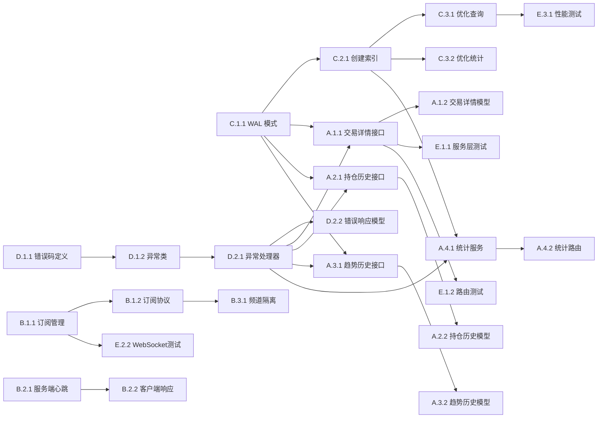

## 3. 依赖关系

### 3.1 依赖图



### 3.2 依赖说明

| 任务 | 依赖于 | 原因 |
|------|--------|------|
| A.1.2 | A.1.1 | 需要先实现接口逻辑，再定义数据模型 |
| A.2.2 | A.2.1 | 需要先实现接口逻辑，再定义响应模型 |
| A.3.2 | A.3.1 | 需要先实现接口逻辑，再定义响应模型 |
| A.4.2 | A.4.1 | 路由依赖统计服务实现 |
| C.2.1 | C.1.1 | 索引创建前需要启用 WAL 模式 |
| C.3.1 | C.2.1 | 查询优化依赖索引 |
| C.3.2 | C.2.1 | 统计查询优化依赖索引 |
| D.1.2 | D.1.1 | 异常类依赖错误码定义 |
| D.2.1 | D.1.2 | 异常处理器依赖异常类 |
| D.2.2 | D.2.1 | 错误响应模型依赖异常处理器 |
| B.1.2 | B.1.1 | 订阅协议依赖订阅管理实现 |
| B.3.1 | B.1.2 | 频道隔离依赖订阅协议 |
| B.2.2 | B.2.1 | 客户端响应依赖服务端心跳 |
| 所有 API 端点 | C.1.1 | 性能优化依赖 WAL 模式 |
| 所有 API 端点 | D.2.1 | 错误处理依赖异常处理器 |
| E.1.1 | A.1.1 | 测试依赖接口实现 |
| E.1.2 | A.1.1 | 测试依赖接口实现 |
| E.2.2 | B.1.1 | WebSocket 测试依赖订阅机制 |
| E.3.1 | C.3.1 | 性能测试依赖查询优化 |

### 3.3 并行任务

以下任务可以并行开发：

**第一批（基础设施）**：
- C.1.1 WAL 模式启用 ∥ D.1.1 错误码定义 ∥ B.1.1 订阅管理

**第二批（核心功能）**：
- A.1.1 交易详情接口 ∥ A.2.1 持仓历史接口 ∥ A.3.1 趋势历史接口
- C.2.1 创建索引 ∥ D.1.2 异常类

**第三批（增强功能）**：
- A.4.1 统计服务 ∥ B.2.1 服务端心跳 ∥ B.3.1 频道隔离
- C.3.1 查询优化 ∥ D.2.1 异常处理器

**第四批（测试与文档）**：
- E.1.1 服务层测试 ∥ E.1.2 路由测试 ∥ E.2.1 集成测试
- E.3.1 性能测试 ∥ E.4.1 API 文档

---

## 4. 实施建议

### 4.1 技术选型

| 需求 | 推荐方案 | 理由 |
|------|----------|------|
| 数据库优化 | SQLite WAL 模式 | 提升并发性能，无需迁移数据库 |
| 请求限流 | slowapi | FastAPI 原生支持，配置简单 |
| 性能测试 | locust | 支持分布式测试，报告清晰 |
| WebSocket 测试 | pytest-asyncio | 支持异步测试，与 FastAPI 集成好 |
| API 文档 | OpenAPI (自动生成) | FastAPI 自动生成，无需额外工作 |
| 连接池 | aiosqlite (可选) | 异步支持，性能更好 |

### 4.2 潜在风险

| 风险 | 影响 | 缓解措施 |
|------|------|----------|
| 数据库锁定 | 高 | 启用 WAL 模式，增加 busy_timeout |
| 性能瓶颈 | 中 | 提前进行性能测试，优化慢查询 |
| WebSocket 连接数限制 | 中 | 配置连接池，添加连接数监控 |
| 索引占用空间 | 低 | 只创建必要索引，定期清理 |
| 限流误伤 | 低 | 配置白名单，调整限流阈值 |
| 测试环境污染 | 低 | 使用独立测试数据库，测试后清理 |
| API 文档不同步 | 低 | 使用 OpenAPI 自动生成，强制类型注解 |

### 4.3 测试策略

**单元测试**：
- 覆盖所有 Service 层方法
- 使用 Mock 数据库，避免依赖真实数据
- 测试边界条件和异常情况
- 目标覆盖率：80%

**集成测试**：
- 测试完整的 API 流程
- 使用独立测试数据库
- 测试数据一致性
- 测试 WebSocket 连接和推送

**性能测试**：
- 测试 API 响应时间（目标 < 200ms）
- 测试并发请求（目标 100 并发）
- 测试数据库查询性能
- 识别性能瓶颈

**压力测试**：
- 模拟高并发场景
- 测试系统极限
- 监控资源占用（CPU、内存、数据库连接）
- 提供优化建议

---

## 5. 验收标准

功能完成需满足以下条件：

### 5.1 功能验收

- [ ] 所有 API 端点正常工作
  - [ ] GET /api/trades/{id} 返回交易详情
  - [ ] GET /api/positions/history 返回持仓历史
  - [ ] GET /api/trends/history 返回趋势历史
  - [ ] GET /api/statistics/* 返回统计数据

- [ ] WebSocket 功能完整
  - [ ] 支持频道订阅/取消订阅
  - [ ] 心跳检测正常工作
  - [ ] 数据推送准确及时
  - [ ] 错误重连机制有效

- [ ] 数据库性能优化
  - [ ] WAL 模式成功启用
  - [ ] 所有必要索引创建完成
  - [ ] 查询性能达标（< 200ms）

- [ ] 错误处理完善
  - [ ] 错误码定义完整
  - [ ] 错误响应格式统一
  - [ ] 请求限流生效

### 5.2 质量验收

- [ ] 代码质量
  - [ ] 代码审查通过
  - [ ] 符合 PEP 8 规范
  - [ ] 类型注解完整
  - [ ] 无高优先级 Bug

- [ ] 测试覆盖
  - [ ] 单元测试覆盖率 ≥ 80%
  - [ ] 集成测试通过
  - [ ] 性能测试达标
  - [ ] 所有测试用例通过

- [ ] 文档完整
  - [ ] OpenAPI 文档完整
  - [ ] API 使用指南完成
  - [ ] 错误码文档清晰
  - [ ] Postman Collection 提供

### 5.3 性能验收

- [ ] API 响应时间 < 200ms（P95）
- [ ] WebSocket 推送延迟 < 100ms
- [ ] 支持 100 并发请求
- [ ] 数据库查询时间 < 100ms（简单查询）
- [ ] 数据库查询时间 < 200ms（统计查询）
- [ ] 无数据库锁定错误

---

## 6. 后续优化方向（可选）

Phase 2 可考虑的增强：

### 6.1 性能优化
- 引入 Redis 缓存热点数据
- 使用 PostgreSQL 替代 SQLite（生产环境）
- 实现查询结果缓存
- 添加 CDN 加速静态资源

### 6.2 功能增强
- 添加数据导出功能（CSV、Excel）
- 实现数据备份和恢复
- 添加用户权限管理
- 支持多用户并发访问

### 6.3 监控告警
- 集成 Prometheus 监控
- 添加 Grafana 可视化
- 实现告警通知（邮件、飞书）
- 添加日志聚合（ELK）

### 6.4 安全增强
- 实现 API Key 管理
- 添加 IP 白名单
- 实现请求签名验证
- 添加 SQL 注入防护

---

## 7. 文件清单

### 7.1 需要创建的文件

```
apps/api/
├── database.py                          # 数据库工具模块
├── errors.py                            # 错误码和异常定义
├── middleware.py                        # 中间件（异常处理、限流）
├── migrations/
│   └── 001_add_indexes.sql             # 索引创建脚本
├── models/
│   └── error.py                         # 错误响应模型
├── routes/
│   └── statistics.py                    # 统计接口路由
├── services/
│   └── statistics_service.py            # 统计服务
├── tests/
│   ├── __init__.py
│   ├── test_trade_service.py           # 服务层测试
│   ├── test_routes.py                  # 路由测试
│   ├── test_integration.py             # 集成测试
│   ├── test_websocket.py               # WebSocket 测试
│   └── test_performance.py             # 性能测试
└── docs/
    ├── API.md                           # API 使用指南
    └── postman_collection.json          # Postman Collection
```

### 7.2 需要修改的文件

```
apps/api/
├── main.py                              # 注册新路由、异常处理器
├── websocket.py                         # 添加订阅机制、心跳检测
├── models/
│   ├── trade.py                         # 添加 TradeDetail 模型
│   ├── position.py                      # 添加 PositionHistoryResponse 模型
│   └── trend.py                         # 添加 TrendHistoryResponse 模型
├── routes/
│   ├── trades.py                        # 添加 GET /api/trades/{id}
│   ├── positions.py                     # 添加 GET /api/positions/history
│   └── trends.py                        # 添加 GET /api/trends/history
└── services/
    ├── trade_service.py                 # 添加 get_trade_by_id 方法
    ├── position_service.py              # 添加 get_position_history 方法
    └── trend_service.py                 # 添加 get_trend_history 方法
```

---

## 8. 开发顺序建议

### Phase 1: 基础设施（优先级：高）
**预估时间**：5-10 小时

1. C.1.1 启用 WAL 模式
2. D.1.1 定义错误码
3. D.1.2 创建异常类
4. D.2.1 实现异常处理器
5. C.2.1 创建索引

### Phase 2: API 端点补充（优先级：高）
**预估时间**：12-24 小时

1. A.1.1 + A.1.2 交易详情接口
2. A.2.1 + A.2.2 持仓历史接口
3. A.3.1 + A.3.2 趋势历史接口
4. A.4.1 + A.4.2 统计分析接口

### Phase 3: WebSocket 增强（优先级：中）
**预估时间**：10-20 小时

1. B.1.1 + B.1.2 订阅机制
2. B.2.1 + B.2.2 心跳检测
3. B.3.1 + B.3.2 频道管理
4. B.4.1 + B.4.2 错误重连

### Phase 4: 性能优化（优先级：中）
**预估时间**：8-16 小时

1. C.3.1 优化交易查询
2. C.3.2 优化统计查询
3. C.3.3 查询性能监控
4. D.3.1 + D.3.2 请求限流

### Phase 5: 测试与文档（优先级：中）
**预估时间**：10-20 小时

1. E.1.1 + E.1.2 单元测试
2. E.2.1 + E.2.2 集成测试
3. E.3.1 + E.3.2 性能测试
4. E.4.1 API 文档

---

## 9. 总结

本规划文档详细分解了 Trading Bot API 完善工作，共包含 **5 个模块**、**45 个任务点**，预估工作量为 **45-90 小时**。

**关键要点**：
1. 优先完成基础设施（WAL 模式、错误处理）
2. 按模块并行开发，提高效率
3. 重视性能优化和测试
4. 保持代码质量和文档完整性

**下一步行动**：
1. 评审本规划文档
2. 分配任务给开发人员
3. 按 Phase 顺序开始开发
4. 定期检查进度和质量

---

**文档版本**：v1.0
**创建时间**：2026-01-12
**最后更新**：2026-01-12
