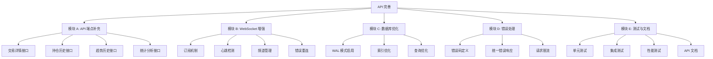

# 功能规划：Trading Bot API 完善

**规划时间**：2026-01-12
**预估工作量**：45 任务点（约 45-90 小时）

---

## 1. 功能概述

### 1.1 目标

完善 Trading Bot 管理系统的 API 开发工作，确保后续 Dashboard 可以顺利调用接口获取数据，提供稳定、高性能、功能完整的后端服务。

### 1.2 范围

**包含**：
- 补充缺失的 API 端点（单个交易详情、持仓历史、趋势历史、统计分析）
- 完善 WebSocket 功能（订阅机制、心跳检测、频道管理、错误重连）
- 数据库性能优化（WAL 模式、索引优化、查询优化）
- 统一错误处理（错误码定义、错误响应格式、请求限流）
- API 测试和文档（单元测试、集成测试、性能测试、API 文档）

**不包含**：
- 前端 Dashboard 开发（已有独立规划）
- 交易机器人核心逻辑修改
- 数据库 Schema 重大变更
- 新增交易策略

### 1.3 技术约束

- **技术栈**：FastAPI + SQLite + Pydantic + JWT
- **性能要求**：API 响应时间 < 200ms，WebSocket 推送延迟 < 100ms
- **兼容性要求**：保持与现有 trading_bot.db 数据库的兼容性
- **服务器限制**：当前服务器性能有限，需要考虑资源优化
- **安全要求**：JWT 认证、请求限流、SQL 注入防护

---

## 2. WBS 任务分解

### 2.1 分解结构图

### 2.2 任务清单

---

## 模块 A：API 端点补充（12 任务点）

### A.1 交易详情接口（3 任务点）

**文件**: `apps/api/routes/trades.py`

- [ ] **任务 A.1.1**：实现 GET /api/trades/{id} 端点（2 点）
  - **输入**：交易 ID
  - **输出**：完整的交易详情（包含关联的标签数据）
  - **关键步骤**：
    1. 在 `TradeService` 中添加 `get_trade_by_id(trade_id: int)` 方法
    2. 查询 `trades` 表和 `trade_tags` 表（LEFT JOIN）
    3. 在 `routes/trades.py` 中添加路由处理函数
    4. 处理交易不存在的情况（返回 404）
  - **验收标准**：
    - 可以通过 ID 获取单个交易的完整信息
    - 包含市场状态、策略信号、Claude 分析等详细数据
    - 交易不存在时返回 404 错误

- [ ] **任务 A.1.2**：添加交易详情数据模型（1 点）
  - **输入**：数据库查询结果
  - **输出**：`TradeDetail` Pydantic 模型
  - **关键步骤**：
    1. 在 `models/trade.py` 中创建 `TradeDetail` 模型
    2. 包含基础交易信息 + 扩展标签信息
    3. 添加字段验证和默认值
  - **验收标准**：
    - 模型包含所有必要字段
    - 字段类型正确，支持可选字段
    - 自动生成 OpenAPI 文档

---

### A.2 持仓历史接口（3 任务点）

**文件**: `apps/api/routes/positions.py`, `apps/api/services/position_service.py`

- [ ] **任务 A.2.1**：实现 GET /api/positions/history 端点（2 点）
  - **输入**：查询参数（limit, offset, start_date, end_date）
  - **输出**：持仓快照历史列表
  - **关键步骤**：
    1. 在 `PositionService` 中添加 `get_position_history()` 方法
    2. 查询 `position_snapshots` 表，支持时间范围筛选
    3. 在 `routes/positions.py` 中添加路由
    4. 支持分页和日期筛选
  - **验收标准**：
    - 可以获取历史持仓快照列表
    - 支持分页和日期范围筛选
    - 返回数据按时间倒序排列

- [ ] **任务 A.2.2**：添加持仓历史响应模型（1 点）
  - **输入**：数据库查询结果
  - **输出**：`PositionHistoryResponse` 模型
  - **关键步骤**：
    1. 在 `models/position.py` 中创建响应模型
    2. 包含分页信息和数据列表
    3. 添加统计摘要（总盈亏、平均持仓时间等）
  - **验收标准**：
    - 模型结构清晰，包含分页信息
    - 支持统计摘要字段
    - 自动生成 API 文档

---

### A.3 趋势历史接口（3 任务点）

**文件**: `apps/api/routes/trends.py`, `apps/api/services/trend_service.py`

- [ ] **任务 A.3.1**：实现 GET /api/trends/history 端点（2 点）
  - **输入**：查询参数（limit, offset, start_date, end_date）
  - **输出**：市场趋势历史数据
  - **关键步骤**：
    1. 在 `TrendService` 中添加 `get_trend_history()` 方法
    2. 查询 `trade_tags` 表的市场状态字段
    3. 聚合市场状态变化数据
    4. 在 `routes/trends.py` 中添加路由
  - **验收标准**：
    - 可以获取历史市场趋势数据
    - 支持时间范围筛选
    - 数据包含市场状态、波动率、置信度等

- [ ] **任务 A.3.2**：添加趋势历史响应模型（1 点）
  - **输入**：聚合后的趋势数据
  - **输出**：`TrendHistoryResponse` 模型
  - **关键步骤**：
    1. 在 `models/trend.py` 中创建响应模型
    2. 包含趋势变化时间线
    3. 添加趋势统计信息
  - **验收标准**：
    - 模型支持时间序列数据
    - 包含趋势统计摘要
    - 字段类型正确

---

### A.4 统计分析接口（3 任务点）

**文件**: `apps/api/routes/statistics.py`, `apps/api/services/statistics_service.py`

- [ ] **任务 A.4.1**：创建统计服务（2 点）
  - **输入**：数据库连接
  - **输出**：`StatisticsService` 类
  - **关键步骤**：
    1. 创建 `services/statistics_service.py`
    2. 实现日统计方法（今日交易、今日盈亏、胜率）
    3. 实现周统计方法（本周交易、周盈亏、策略对比）
    4. 实现月统计方法（月度盈亏、月度胜率、趋势分析）
  - **验收标准**：
    - 支持日/周/月三种统计维度
    - 统计数据准确
    - 查询性能优化（使用索引）

- [ ] **任务 A.4.2**：实现统计接口路由（1 点）
  - **输入**：统计类型和时间范围
  - **输出**：统计数据
  - **关键步骤**：
    1. 创建 `routes/statistics.py`
    2. 添加 GET /api/statistics/daily 路由
    3. 添加 GET /api/statistics/weekly 路由
    4. 添加 GET /api/statistics/monthly 路由
    5. 添加 GET /api/statistics/strategy-comparison 路由
  - **验收标准**：
    - 所有统计接口可正常访问
    - 返回数据格式统一
    - 支持日期范围参数

---

