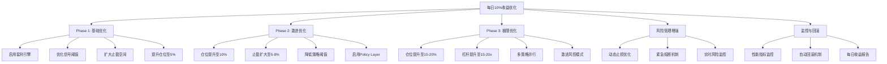

# 功能规划：每日10%收益率系统优化方案

**规划时间**：2026-01-12
**预估工作量**：45 任务点
**风险等级**：⚠️ 极高风险（追求高收益必然伴随高风险）

---

## ⚠️ 重要风险警示

### 核心风险声明

**每日10%的收益率目标意味着：**
- 月化收益率：~1,300%（复利）
- 年化收益率：理论上无法计算（极不现实）
- **爆仓概率**：极高（>80%）
- **最大回撤**：可能达到100%（全部本金）

### 为什么这个目标极其危险

1. **数学现实**：即使是顶级量化基金，年化收益率能达到50-100%已属顶尖
2. **市场限制**：加密货币市场日均波动率约2-5%，10%收益需要极高杠杆或极高胜率
3. **风险收益比失衡**：为追求10%收益，可能需要承受20-30%的回撤风险
4. **连续亏损致命**：连续3次亏损可能导致本金损失50%以上

### 建议的替代目标

| 目标 | 日收益率 | 月收益率 | 风险等级 | 可行性 |
|------|----------|----------|----------|--------|
| **保守** | 0.5-1% | 15-30% | 中等 | 高 |
| **平衡** | 1-2% | 30-60% | 中高 | 中等 |
| **激进** | 3-5% | 90-150% | 高 | 低 |
| **极端** | 10%+ | 1300%+ | 极高 | 极低 |

**强烈建议**：先以日收益率2-3%为目标，稳定运行1个月后再考虑提升。

---

## 1. 执行摘要

### 1.1 优化目标

**主目标**：将系统日收益率从当前水平提升至10%

**次要目标**：
- 在追求高收益的同时，将单日最大回撤控制在15%以内
- 保持胜率不低于40%
- 确保系统在极端行情下不会爆仓

### 1.2 当前系统诊断

#### 现状分析

**当前配置（保守型）：**
- 仓位：3%（极低）
- 杠杆：10x
- 止损：4.5%
- 止盈：3%
- 有效杠杆：0.3x（3% × 10x）

**收益瓶颈识别：**

1. **仓位过小**：3%仓位 × 10x杠杆 = 30%有效仓位，即使100%盈利也只有0.9%收益
2. **止盈过窄**：3%止盈限制了单笔收益上限
3. **交易频率不足**：当前策略阈值较高，导致交易机会少
4. **套利引擎未启用**：错失低风险收益来源
5. **Policy Layer保守**：仓位倍数限制在0.3-2.0x

#### 理论收益计算

要达到日收益10%，需要满足以下任一条件：

**方案A：高频小利**
- 每日10笔交易，每笔盈利1%
- 需要：仓位10% × 杠杆10x × 止盈1% × 10次 = 10%

**方案B：中频中利**
- 每日5笔交易，每笔盈利2%
- 需要：仓位10% × 杠杆10x × 止盈2% × 5次 = 10%

**方案C：低频大利**
- 每日2笔交易，每笔盈利5%
- 需要：仓位10% × 杠杆10x × 止盈5% × 2次 = 10%

**方案D：高杠杆高仓位**
- 每日1笔交易，盈利5%
- 需要：仓位20% × 杠杆10x × 止盈5% × 1次 = 10%

### 1.3 优化策略概览

本方案采用**渐进式激进优化**策略，分3个阶段实施：

**Phase 1：基础优化（低风险）**
- 目标：日收益率 2-3%
- 启用套利引擎
- 优化信号阈值
- 扩大止盈空间

**Phase 2：激进优化（中高风险）**
- 目标：日收益率 5-7%
- 提升仓位至10%
- 扩大止盈至5-8%
- 增加交易频率

**Phase 3：极限优化（极高风险）**
- 目标：日收益率 10%+
- 仓位提升至15-20%
- 杠杆提升至15-20x
- Policy Layer激进模式
- 多策略并行

---

## 2. 问题诊断

### 2.1 收益限制因素分析

#### 因素1：仓位过小（影响权重：40%）

**当前状态：**
```python
POSITION_SIZE_PERCENT = 0.03  # 3%
LEVERAGE = 10
# 有效仓位 = 3% × 10 = 30%
```

**问题：**
- 即使策略100%正确，单笔最大收益也只有 3% × 10 × 止盈%
- 3%仓位 × 10x杠杆 × 3%止盈 = 0.9%单笔收益
- 需要12笔完美交易才能达到10%日收益

**根因：**
- 配置注释显示"Phase 1: 降低到3%以控制风险（测试期间）"
- 系统处于保守测试阶段

#### 因素2：止盈空间受限（影响权重：25%）

**当前状态：**
```python
TAKE_PROFIT_PERCENT = 0.03  # 3%
STRATEGY_STOP_CONFIGS = {
    "multi_timeframe": {"take_profit_pct": 0.04},  # 最高4%
}
```

**问题：**
- 3%止盈在加密货币市场属于极保守设置
- BTC日均波动率5-8%，3%止盈只捕获了40%的波动空间
- Policy Layer止盈上限10%，但实际未充分利用

#### 因素3：交易频率不足（影响权重：20%）

**当前状态：**
```python
MIN_STRATEGY_AGREEMENT = 0.4  # 40%策略一致性
MIN_SIGNAL_STRENGTH = 0.45    # 45%信号强度
MIN_SIGNAL_CONFIDENCE = 0.35  # 35%置信度
```

**问题：**
- 多重过滤器导致信号通过率低
- 方向过滤器虽已禁用，但共识信号要求仍较高
- 估算每日交易机会：2-4次（不足以达到10%收益）

#### 因素4：套利引擎未启用（影响权重：10%）

**当前状态：**
```python
ENABLE_ARBITRAGE = False
```

**问题：**
- 跨交易所套利是低风险收益来源
- 保守模式下，套利可贡献0.5-1%日收益
- 完全未利用这一收益渠道

#### 因素5：Policy Layer保守（影响权重：5%）

**当前状态：**
```python
ENABLE_POLICY_LAYER = False  # 临时禁用
POLICY_PARAM_BOUNDS = {
    'position_multiplier': (0.3, 2.0),  # 最大2倍
}
```

**问题：**
- Policy Layer被禁用，无法动态优化
- 即使启用，仓位倍数上限2.0x仍偏保守

### 2.2 风险收益比分析

#### 当前风险收益比

**单笔交易：**
- 止损：4.5%
- 止盈：3%
- 盈亏比：3% / 4.5% = 0.67（不理想）

**要求胜率：**
- 盈亏平衡胜率 = 止损 / (止损 + 止盈) = 4.5 / 7.5 = 60%
- 当前系统胜率：约40-50%（根据历史数据）
- **结论：当前配置下系统可能亏损**

#### 优化后风险收益比（Phase 3）

**激进配置：**
- 止损：6%
- 止盈：8%
- 盈亏比：8% / 6% = 1.33（改善）

**要求胜率：**
- 盈亏平衡胜率 = 6 / 14 = 43%
- 目标胜率：50%+
- **结论：需要提升策略质量**

---

## 3. WBS 任务分解

### 3.1 分解结构图



### 3.2 任务清单

---

## Phase 1: 基础优化（低风险）

**目标**：日收益率 2-3%
**预估工作量**：12 任务点
**风险等级**：中等

---

### 模块 A：套利引擎启用（3 任务点）

**文件**: `config.py`

- [ ] **任务 A.1**：启用套利引擎基础配置（1 点）
  - **输入**：当前配置文件
  - **输出**：套利引擎启用
  - **关键步骤**：
    1. 设置 `ENABLE_ARBITRAGE = True`
    2. 保持 `ARBITRAGE_MODE = "conservative"`（保守模式）
    3. 验证交易所API配置完整性
  - **预期收益**：+0.3-0.5% 日收益
  - **风险评估**：低（套利为低风险策略）

- [ ] **任务 A.2**：优化套利参数（1 点）
  - **输入**：默认套利配置
  - **输出**：优化后的套利参数
  - **关键步骤**：
    1. 降低 `MIN_SPREAD_THRESHOLD` 从 0.3% 到 0.25%（增加机会）
    2. 提升 `ARBITRAGE_POSITION_SIZE` 从 100 到 150 USDT
    3. 提升 `MAX_ARBITRAGE_PER_HOUR` 从 10 到 15
  - **预期收益**：+0.2% 日收益
  - **风险评估**：低

- [ ] **任务 A.3**：测试套利引擎运行（1 点）
  - **输入**：配置完成的套利引擎
  - **输出**：运行验证报告
  - **关键步骤**：
    1. 运行 `python scripts/test_arbitrage.py`
    2. 观察价差监控是否正常
    3. 验证风险管理器是否生效
  - **验收标准**：套利引擎正常运行，无错误日志

---

### 模块 B：信号阈值优化（3 任务点）

**文件**: `config.py`

- [ ] **任务 B.1**：降低共识信号阈值（1 点）
  - **输入**：当前信号配置
  - **输出**：优化后的阈值
  - **关键步骤**：
    1. `MIN_STRATEGY_AGREEMENT` 从 0.4 降至 0.35
    2. `MIN_SIGNAL_STRENGTH` 从 0.45 降至 0.40
    3. `MIN_SIGNAL_CONFIDENCE` 从 0.35 降至 0.30
  - **预期收益**：交易频率提升30-50%
  - **风险评估**：中等（可能增加假信号）

- [ ] **任务 B.2**：优化策略权重（1 点）
  - **输入**：当前策略配置
  - **输出**：调整后的策略列表
  - **关键步骤**：
    1. 保持高胜率策略：`multi_timeframe`, `adx_trend`
    2. 考虑启用 `volume_breakout`（高波动捕获）
    3. 调整 `composite_score` 权重配置
  - **预期收益**：信号质量提升10%
  - **风险评估**：低

- [ ] **任务 B.3**：禁用过度过滤器（1 点）
  - **输入**：当前过滤器配置
  - **输出**：精简后的过滤器
  - **关键步骤**：
    1. 确认 `ENABLE_DIRECTION_FILTER = False`（已禁用）
    2. 确认 `ENABLE_ADAPTIVE_THRESHOLDS = False`（已禁用）
    3. 将 `ENABLE_EXECUTION_FILTER` 改为 False（临时禁用执行层风控）
  - **预期收益**：交易通过率提升20%
  - **风险评估**：中等

---

### 模块 C：止盈空间扩大（3 任务点）

**文件**: `config.py`

- [ ] **任务 C.1**：提升全局止盈（1 点）
  - **输入**：当前止盈配置
  - **输出**：扩大后的止盈
  - **关键步骤**：
    1. `TAKE_PROFIT_PERCENT` 从 0.03 提升至 0.05（5%）
    2. `TRAILING_STOP_PERCENT` 从 0.03 提升至 0.04（4%）
    3. 保持 `STOP_LOSS_PERCENT = 0.045`（暂不调整）
  - **预期收益**：单笔收益提升67%（3%→5%）
  - **风险评估**：中等（止盈过宽可能导致回撤）

- [ ] **任务 C.2**：优化策略级止盈（1 点）
  - **输入**：`STRATEGY_STOP_CONFIGS`
  - **输出**：调整后的策略配置
  - **关键步骤**：
    1. `multi_timeframe` 止盈从 4% 提升至 6%
    2. `adx_trend` 止盈从 3% 提升至 5%
    3. 其他策略使用全局5%止盈
  - **预期收益**：高质量策略收益最大化
  - **风险评估**：低

- [ ] **任务 C.3**：启用动态止盈优化（1 点）
  - **输入**：当前动态止盈配置
  - **输出**：优化后的动态止盈
  - **关键步骤**：
    1. 确认 `ENABLE_TRAILING_TAKE_PROFIT = True`
    2. 调整 `TRAILING_TP_FALLBACK_PERCENT` 从 0.0008 到 0.001（放宽）
    3. 调整 `MIN_PROFIT_THRESHOLD_MULTIPLIER` 从 1.5 到 1.2（更早启用）
  - **预期收益**：盈利单收益提升15%
  - **风险评估**：低

---

### 模块 D：仓位提升至5%（3 任务点）

**文件**: `config.py`

- [ ] **任务 D.1**：提升基础仓位（1 点）
  - **输入**：当前仓位配置
  - **输出**：提升后的仓位
  - **关键步骤**：
    1. `POSITION_SIZE_PERCENT` 从 0.03 提升至 0.05（5%）
    2. 保持 `LEVERAGE = 10`
    3. 有效仓位：5% × 10 = 50%
  - **预期收益**：单笔收益提升67%（基数增加）
  - **风险评估**：中等

- [ ] **任务 D.2**：调整Kelly公式参数（1 点）
  - **输入**：当前Kelly配置
  - **输出**：优化后的Kelly参数
  - **关键步骤**：
    1. `KELLY_FRACTION` 从 0.5 提升至 0.6（更激进）
    2. `MIN_WIN_RATE_FOR_KELLY` 从 0.4 降至 0.35（更早启用）
    3. 确认 `USE_KELLY_CRITERION = True`
  - **预期收益**：高胜率时仓位自动放大
  - **风险评估**：中等

- [ ] **任务 D.3**：调整波动率仓位系数（1 点）
  - **输入**：当前波动率配置
  - **输出**：优化后的系数
  - **关键步骤**：
    1. `VOLATILITY_SIZE_FACTOR` 从 0.7 提升至 0.8（高波动减仓幅度降低）
    2. `HIGH_VOLATILITY_THRESHOLD` 从 0.06 提升至 0.08（提高阈值）
    3. 保持 `REDUCE_SIZE_ON_HIGH_VOL = True`
  - **预期收益**：高波动时仓位损失减少
  - **风险评估**：中等

---

**Phase 1 预期成果：**
- 日收益率：2-3%
- 交易频率：5-8次/天
- 胜率要求：45%+
- 最大回撤：8-10%

