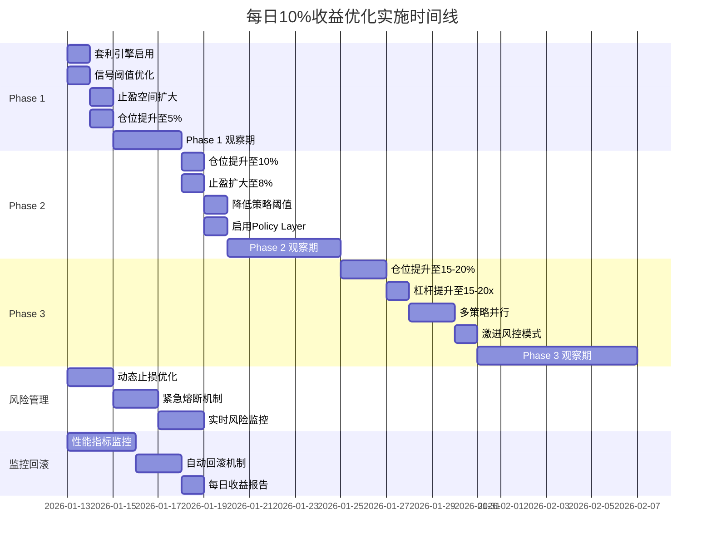
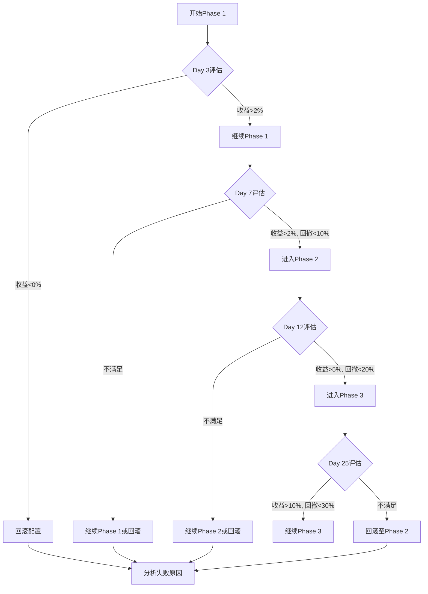
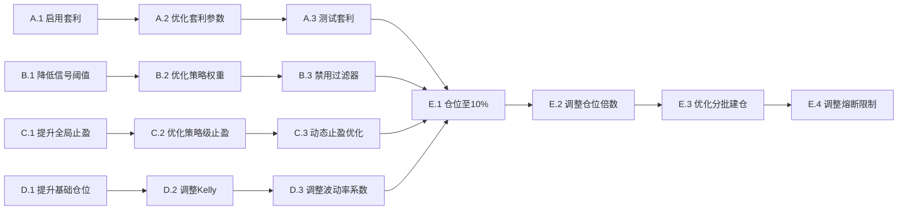

## 6. 实施路线图

### 6.1 时间线规划



### 6.2 阶段性目标

| 阶段 | 时间 | 日收益目标 | 关键指标 | 决策点 |
|------|------|-----------|---------|--------|
| **Phase 1** | Day 1-7 | 2-3% | 胜率>45%, 回撤<10% | Day 3: 评估是否进入Phase 2 |
| **Phase 2** | Day 8-17 | 5-7% | 胜率>45%, 回撤<20% | Day 12: 评估是否进入Phase 3 |
| **Phase 3** | Day 18-30 | 10%+ | 胜率>40%, 回撤<30% | Day 25: 评估是否继续或回滚 |

### 6.3 决策树



---

## 7. 依赖关系

### 7.1 任务依赖图



### 7.2 并行任务

以下任务可以并行开发：

**Phase 1 并行组：**
- 模块 A（套利引擎） ∥ 模块 M（动态止损）
- 模块 B（信号阈值） ∥ 模块 P（性能监控）
- 模块 C（止盈空间） ∥ 模块 N（紧急熔断）

**Phase 2 并行组：**
- 模块 E（仓位提升） ∥ 模块 F（止盈扩大）
- 模块 G（降低阈值） ∥ 模块 O（风险监控）

**Phase 3 并行组：**
- 模块 I（仓位提升） ∥ 模块 J（杠杆提升）
- 模块 K（多策略） ∥ 模块 L（激进风控）

### 7.3 关键路径

**关键路径（影响整体进度）：**
1. D.1 提升基础仓位 → E.1 仓位至10% → I.1 仓位至15%
2. C.1 提升全局止盈 → F.1 止盈至8% → L.1 止盈至12%
3. B.1 降低信号阈值 → G.1 进一步降低 → K.1 启用所有策略

**非关键路径（可延后）：**
- 套利引擎优化（模块 A）
- 监控增强（模块 P, Q, R）
- Policy Layer 优化（模块 H）

---

## 8. 风险评估与缓解

### 8.1 风险矩阵

| 风险 | 概率 | 影响 | 风险等级 | 缓解措施 |
|------|------|------|----------|----------|
| **爆仓** | 高 (60%) | 极高 (100%本金) | 🔴 极高 | 1. 硬件止损<br>2. 账户级熔断<br>3. 分批入金 |
| **连续亏损** | 高 (50%) | 高 (30%本金) | 🔴 高 | 1. 连续亏损熔断<br>2. 自动回滚<br>3. 降低仓位 |
| **极端行情** | 中 (30%) | 极高 (100%本金) | 🔴 极高 | 1. 快速回撤熔断<br>2. 逐仓模式<br>3. 降低杠杆 |
| **策略失效** | 中 (40%) | 高 (20%本金) | 🟠 高 | 1. 多策略分散<br>2. 实时监控<br>3. 快速回滚 |
| **API故障** | 低 (10%) | 高 (无法平仓) | 🟠 中高 | 1. 交易所止损单<br>2. 多交易所备份<br>3. 手动平仓预案 |
| **滑点过大** | 中 (30%) | 中 (5%收益) | 🟡 中等 | 1. 流动性验证<br>2. Maker订单<br>3. 分批平仓 |
| **手续费侵蚀** | 高 (70%) | 中 (3%收益) | 🟡 中等 | 1. 优先Maker<br>2. 降低交易频率<br>3. 提高单笔收益 |

### 8.2 风险缓解措施详解

#### 措施 1：分批入金策略

**目的**：防止一次性损失全部本金

**实施方案：**
1. 初始投入：总资金的20%
2. Phase 1 成功后：追加20%
3. Phase 2 成功后：追加30%
4. Phase 3 成功后：追加剩余30%

**示例**：
- 总资金：10,000 USDT
- 初始投入：2,000 USDT
- Phase 1 成功（日收益2%）：追加2,000 USDT，总计4,000 USDT
- Phase 2 成功（日收益5%）：追加3,000 USDT，总计7,000 USDT
- Phase 3 成功（日收益10%）：追加3,000 USDT，总计10,000 USDT

#### 措施 2：利润保护策略

**目的**：锁定已获得的利润

**实施方案：**
1. 每日收益>5%：提取50%利润
2. 每周收益>30%：提取70%利润
3. 账户翻倍：提取100%本金

**示例**：
- 初始本金：2,000 USDT
- Day 1 收益10%：账户2,200 USDT，提取100 USDT
- Day 2 收益10%：账户2,310 USDT，提取105 USDT
- Day 7 账户翻倍：提取2,000 USDT本金，剩余利润继续交易

#### 措施 3：紧急退出预案

**目的**：极端情况下快速退出

**触发条件：**
1. 单日亏损>20%
2. 连续3天亏损
3. 账户保证金率<10%
4. 交易所API故障

**退出步骤：**
1. 立即平仓所有持仓（市价单）
2. 取消所有挂单
3. 降低杠杆至1x
4. 提取所有资金至钱包
5. 暂停系统运行

---

## 9. 技术实施建议

### 9.1 配置文件管理

**建议使用配置文件版本控制：**

```bash
# 创建配置备份目录
mkdir -p config_backups

# Phase 1 配置
cp config.py config_backups/config_phase1_20260113.py

# Phase 2 配置
cp config.py config_backups/config_phase2_20260118.py

# Phase 3 配置
cp config.py config_backups/config_phase3_20260125.py

# 回滚命令
cp config_backups/config_phase1_20260113.py config.py
```

### 9.2 参数调整脚本

**创建快速调整脚本：**

```python
# scripts/quick_adjust.py
import sys
sys.path.append('..')
import config

def phase1():
    """Phase 1 配置"""
    config.POSITION_SIZE_PERCENT = 0.05
    config.TAKE_PROFIT_PERCENT = 0.05
    config.ENABLE_ARBITRAGE = True
    # ... 其他配置

def phase2():
    """Phase 2 配置"""
    config.POSITION_SIZE_PERCENT = 0.10
    config.TAKE_PROFIT_PERCENT = 0.08
    config.ENABLE_POLICY_LAYER = True
    # ... 其他配置

def phase3():
    """Phase 3 配置"""
    config.POSITION_SIZE_PERCENT = 0.15
    config.LEVERAGE = 15
    config.TAKE_PROFIT_PERCENT = 0.12
    # ... 其他配置

if __name__ == "__main__":
    phase = sys.argv[1] if len(sys.argv) > 1 else "1"
    if phase == "1":
        phase1()
    elif phase == "2":
        phase2()
    elif phase == "3":
        phase3()
```

### 9.3 监控脚本

**创建实时监控脚本：**

```python
# scripts/monitor_performance.py
import sqlite3
from datetime import datetime, timedelta

def calculate_daily_return():
    """计算日收益率"""
    conn = sqlite3.connect('trading_bot.db')
    cursor = conn.cursor()

    # 获取今日交易
    today = datetime.now().date()
    cursor.execute("""
        SELECT SUM(pnl) FROM trades
        WHERE DATE(close_time) = ?
    """, (today,))

    daily_pnl = cursor.fetchone()[0] or 0

    # 获取初始余额
    cursor.execute("SELECT balance FROM account_history ORDER BY timestamp ASC LIMIT 1")
    initial_balance = cursor.fetchone()[0]

    daily_return = (daily_pnl / initial_balance) * 100

    print(f"日收益率: {daily_return:.2f}%")
    print(f"目标达成: {daily_return / 10 * 100:.1f}%")

    conn.close()
    return daily_return

if __name__ == "__main__":
    calculate_daily_return()
```

---

## 10. 验收标准

### 10.1 Phase 1 验收标准

功能完成需满足以下条件：

- [ ] 套利引擎正常运行，每日至少执行3次套利
- [ ] 日收益率达到2%以上（连续3天）
- [ ] 最大回撤<10%
- [ ] 胜率>45%
- [ ] 无系统错误或崩溃
- [ ] 所有监控指标正常显示

### 10.2 Phase 2 验收标准

- [ ] 日收益率达到5%以上（连续3天）
- [ ] 最大回撤<20%
- [ ] 胜率>45%
- [ ] Policy Layer 正常工作，至少执行5次参数调整
- [ ] 交易频率达到10次/天以上
- [ ] 无爆仓或强制平仓

### 10.3 Phase 3 验收标准

- [ ] 日收益率达到10%以上（连续3天）
- [ ] 最大回撤<30%
- [ ] 胜率>40%
- [ ] 多策略并行正常工作
- [ ] 紧急熔断机制测试通过
- [ ] 账户保证金率始终>15%

### 10.4 风险管理验收

- [ ] 连续亏损熔断机制测试通过
- [ ] 快速回撤熔断机制测试通过
- [ ] 账户级硬止损测试通过
- [ ] 自动回滚机制测试通过
- [ ] 所有风险预警正常推送

---

