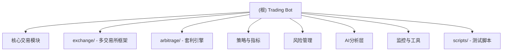

# Trading Bot - 量化交易机器人

> 最后更新: 2026-01-09 | 版本: v1.0.1

## 变更记录 (Changelog)

### 2026-01-09 - 初始化架构文档
- 生成项目架构文档
- 识别8个核心模块
- 建立模块索引和导航

---

## 项目愿景

Trading Bot 是一个功能完整的加密货币量化交易系统，支持多交易所、多策略、AI辅助决策和跨交易所套利。系统采用模块化设计，具备完善的风险管理、实时监控和智能分析能力。

**核心特性：**
- 多交易所支持（Bitget、Binance、OKX）
- 10+ 交易策略（布林带、MACD、RSI、EMA等）
- AI辅助决策（Claude API集成）
- 机器学习信号过滤
- 跨交易所套利引擎
- 完善的风险管理系统
- 实时监控与通知（飞书、邮件）

---

## 架构总览

### 系统架构

```
trading_bot/
├── 核心交易层
│   ├── bot.py              # 主交易机器人
│   ├── trader.py           # 交易执行器
│   └── main.py             # 程序入口
│
├── 策略与指标层
│   ├── strategies.py       # 交易策略集合
│   ├── indicators.py       # 技术指标计算
│   └── market_regime.py    # 市场状态检测
│
├── 风险管理层
│   ├── risk_manager.py     # 风险管理器
│   ├── execution_filter.py # 执行层风控
│   └── liquidity_validator.py # 流动性验证
│
├── AI分析层
│   ├── claude_analyzer.py  # Claude实时分析
│   ├── ml_predictor.py     # 机器学习预测
│   └── policy_layer.py     # 策略治理层
│
├── 多交易所框架
│   └── exchange/           # 交易所适配器
│
├── 套利引擎
│   └── arbitrage/          # 跨交易所套利
│
└── 监控与工具
    ├── status_monitor.py   # 状态监控
    ├── logger_utils.py     # 日志系统
    └── scripts/            # 测试脚本
```

### 模块结构图



---

## 模块索引

| 模块 | 路径 | 职责 | 关键文件 |
|------|------|------|----------|
| **核心交易模块** | `/` | 主交易逻辑、订单执行、策略调度 | `bot.py`, `trader.py`, `main.py` |
| **多交易所框架** | `exchange/` | 统一交易所接口、适配器模式 | `manager.py`, `adapters/` |
| **套利引擎** | `arbitrage/` | 跨交易所价差监控与套利执行 | `engine.py`, `spread_monitor.py` |
| **策略与指标** | `/` | 交易策略、技术指标、市场状态 | `strategies.py`, `indicators.py` |
| **风险管理** | `/` | 仓位管理、止损止盈、流动性验证 | `risk_manager.py`, `execution_filter.py` |
| **AI分析层** | `/` | Claude分析、ML预测、策略治理 | `claude_analyzer.py`, `ml_predictor.py` |
| **监控与工具** | `/` | 状态监控、日志、通知推送 | `status_monitor.py`, `logger_utils.py` |
| **测试脚本** | `scripts/` | 功能测试、诊断工具 | `test_*.py`, `diagnose_*.py` |

---

## 运行与开发

### 环境准备

```bash
# 1. 创建虚拟环境
python -m venv venv
source venv/bin/activate  # Linux/macOS
# venv\Scripts\activate   # Windows

# 2. 安装依赖
pip install -r requirements.txt

# 3. 配置环境变量
cp .env.example .env
# 编辑 .env 填入 API 密钥
```

### 启动命令

```bash
# 实盘交易
python main.py live

# 回测
python main.py backtest --symbol BTC/USDT --timeframe 15m --limit 1000

# 查看状态
python main.py status

# Docker 部署
docker-compose up -d
```

### 配置说明

核心配置文件：`config.py`

**关键配置项：**
- `ACTIVE_EXCHANGE`: 当前使用的交易所（bitget/binance/okx）
- `ENABLE_STRATEGIES`: 启用的策略列表
- `LEVERAGE`: 杠杆倍数（默认10x）
- `STOP_LOSS_PERCENT`: 止损比例（默认4.5%）
- `ENABLE_CLAUDE_ANALYSIS`: 是否启用Claude分析
- `ENABLE_ARBITRAGE`: 是否启用套利引擎

---

## 测试策略

### 单元测试

```bash
# 运行完整测试套件
python test_all.py

# 测试特定模块
python scripts/test_trading.py
python scripts/test_risk_manager.py
python scripts/test_claude_integration.py
```

### 回测验证

```bash
# 策略回测
python backtest.py

# 策略对比
python main.py backtest --compare --strategies macd_cross,ema_cross,bollinger_trend
```

### 诊断工具

```bash
# 布林带诊断
python scripts/diagnose_bollinger.py

# 信号诊断
python diagnose_signals.py

# 数据库查看
python scripts/db_viewer.py
```

---

## 编码规范

### Python 风格
- 遵循 PEP 8 规范
- 使用类型注解（typing）
- 文档字符串使用 Google 风格

### 模块组织
- 单一职责原则
- 依赖注入模式
- 单例模式（用于全局服务）

### 错误处理
- 使用自定义异常类（`exchange/errors.py`）
- 错误退避机制（`error_backoff_controller.py`）
- 完整的日志记录

### 配置管理
- 环境变量优先（`.env`）
- 配置验证（`config_validator.py`）
- 分层配置（全局/模块/策略级）

---

## AI 使用指引

### Claude 集成

**实时信号分析：**
- 模块：`claude_analyzer.py`
- 触发：每次生成交易信号时
- 用途：验证信号质量、风险评估

**定期市场分析：**
- 模块：`claude_periodic_analyzer.py`
- 频率：每30分钟（可配置）
- 用途：市场趋势分析、持仓建议

**策略治理层：**
- 模块：`policy_layer.py`
- 功能：动态调整止损止盈参数
- 模式：shadow（观察）/ active（生效）

### 机器学习

**信号质量预测：**
- 模块：`ml_predictor.py` / `ml_predictor_lite.py`
- 模型：随机森林分类器
- 特征：20+ 技术指标和市场特征
- 模式：shadow（记录）/ filter（过滤）

**模型训练：**
```bash
python model_trainer.py
```

### API 配置

```bash
# .env 文件
ANTHROPIC_AUTH_TOKEN=your_claude_api_key
ANTHROPIC_BASE_URL=https://api.anthropic.com  # 可选
```

---

## 常见问题

### 交易相关

**Q: 如何切换交易所？**
```python
# config.py
ACTIVE_EXCHANGE = "binance"  # bitget/binance/okx
```

**Q: 如何调整风险参数？**
```python
# config.py
STOP_LOSS_PERCENT = 0.045      # 止损4.5%
TAKE_PROFIT_PERCENT = 0.03     # 止盈3%
POSITION_SIZE_PERCENT = 0.03   # 仓位3%
```

**Q: 如何启用套利引擎？**
```python
# config.py
ENABLE_ARBITRAGE = True
ARBITRAGE_MODE = "conservative"  # conservative/balanced/aggressive
```

### 技术问题

**Q: API 连接失败？**
- 检查 `.env` 文件中的 API 密钥
- 确认 API 权限（需要合约交易权限）
- 查看日志：`logs/error.log`

**Q: 数据库错误？**
```bash
# 运行数据库修复测试
python scripts/test_database_fix.py
```

**Q: Claude API 调用失败？**
- 检查 API Key 配置
- 查看护栏限制：`claude_guardrails.py`
- 临时禁用：`ENABLE_CLAUDE_ANALYSIS = False`

### 监控问题

**Q: 如何查看实时状态？**
```bash
# 命令行查看
python cli.py status

# 飞书推送（需配置 Webhook）
ENABLE_STATUS_MONITOR = True
```

**Q: 日志文件在哪里？**
```
logs/
├── info.log      # 常规日志
├── error.log     # 错误日志
├── debug.log     # 调试日志
└── warning.log   # 警告日志
```

---

## 相关资源

### 文档
- [README.md](./README.md) - 快速开始指南
- [CHANGELOG.md](./CHANGELOG.md) - 版本更新日志
- [docs/](./docs/) - 详细功能文档

### 配置文件
- `config.py` - 主配置文件
- `.env` - 环境变量（需自行创建）
- `docker-compose.yml` - Docker 配置

### 数据库
- `trading_bot.db` - SQLite 数据库
- 表结构：trades, signals, positions, ml_predictions

---

**项目状态：** ✅ 稳定运行
**最新版本：** v1.0.1
**Python 版本：** 3.8+
**主要依赖：** ccxt, pandas, numpy, ta, anthropic
